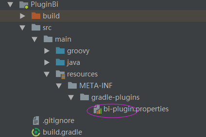

# javassist Demo
这里主要介绍一些javassist在Android中的基本使用方法，以及一个简单的实例；
在做这个Demo时，也从网络上获取过相关知识，只是大部分都是copy的，没有很大的参考价值，而且坑也比较多，这里主要就是记录采坑记吧！
## 1、准备工作：
* 新建一个android项目，然后添加一个LibraryModule, 删除app(没什么用)<br>
* 在项目的根目录下的gradle文件中添加依赖<br>
```groovy
dependencies {
        ...
        classpath 'com.github.dcendents:android-maven-gradle-plugin:2.0'
        ...
    }
```
* 在LibraryModule的gradle文件中改成如下代码<br>
```groovy
apply plugin: 'groovy'
apply plugin: 'maven'

//group = 'com.github.alfredxl' //这里是你的github地址，如果使用jitpack发布该插件，这里需要填上你自己的github地址
dependencies {
    compile gradleApi()
    compile localGroovy()
    compile 'com.android.tools.build:gradle:2.3.3'
    compile 'org.javassist:javassist:3.20.0-GA'
}

repositories {
    google()
    jcenter()
}
//下面的配置是为了发布到本地，发布到本地主要是测试方便
uploadArchives {
    repositories.mavenDeployer {
        repository(url: uri('E:\\localGradlePlugin'))//你要存放的路径
        pom.groupId = 'com.github.alfredxl'//包名
        pom.artifactId = 'testjavassist'//在需要引用插件时用到
        pom.version = '1.7.3'
    }
}
```
* 删除Module下多余的文件和文件夹，保留如下截图的文件结构：<br>

其中图中画红圈的地方的命名将是后面讲到的plugin的名称，后面将会详细讲到，我们打开这个文件，里面会直接链接到你开发的插件类：
```groovy
implementation-class=com.bi.BiPlugin
```
在本例中，插件代码类就是BiPlugin